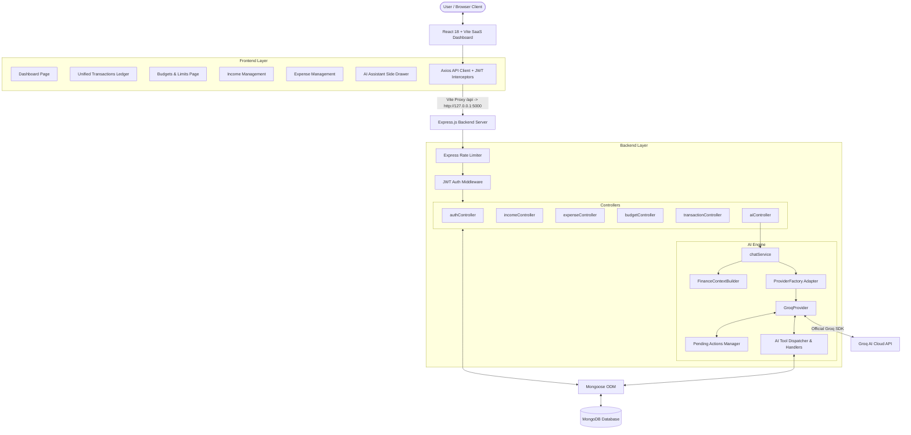
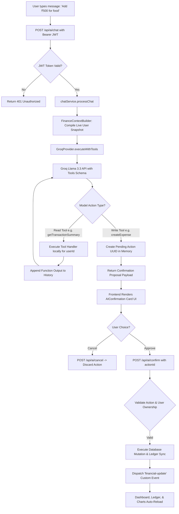
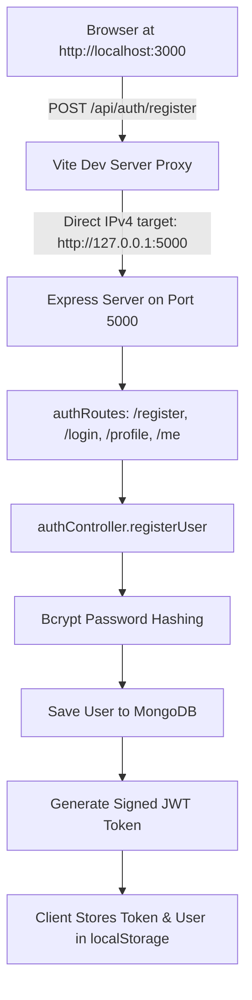

# Smart Personal Finance Dashboard MVP 💰

A full-stack, AI-powered personal finance management dashboard built with **React 18**, **Node.js / Express**, **MongoDB / Mongoose**, and **Groq AI (Llama 3.3 70B)**.

The dashboard provides real-time financial tracking, monthly budget planning, expense analytics, category breakdowns, savings insights, and an interactive **Personal Finance AI Assistant** capable of natural language queries (English & Hinglish), multi-turn reasoning, and safe interactive transaction mutations.

---

## 🌟 Key Features

- 📊 **Unified Financial Ledger & Dashboard**: Real-time aggregated statistics for Total Income, Total Expenses, Net Savings, Budget Utilization, and MoM Trends.
- 💳 **Complete Income & Expense Management**: Full CRUD operations with automatic ledger reconciliation in MongoDB.
- 🎯 **Monthly Budgeting & Smart Limits**: Set monthly spending caps with progress tracking, visual utilization indicators, and automatic over-budget warnings.
- 🤖 **Intelligent Financial AI Assistant (Powered by Groq Llama 3.3)**:
  - **Natural Language & Hinglish Understanding**: Processes queries like *"bhai iss month sabse zyada kharcha kaha hua?"*, *"Meri total income kitni hai?"*, *"Add ₹500 food expense today"*, *"Compare this month's spending with last month"*.
  - **Multi-Turn Tool Reasoning**: Autonomously calls and chains backend analytical tools (up to 5 turns) before formulating answers.
  - **Automated Financial Context Injection**: Automatically provides the AI with the user's real-time financial metrics, budget utilization, and spending alerts.
  - **Safe Write Actions & Confirmation Cards**: Protects against accidental database changes by presenting interactive confirmation cards (Approve / Cancel) before executing any create, update, or delete operations.
  - **Personalized Financial Health Insights**: AI-generated structured recommendations, spending distribution alerts, and savings advice.
- 🔒 **Enterprise-Grade Security**:
  - Stateless JWT (JsonWebToken) session authentication.
  - Strict user-level data isolation preventing cross-tenant access.
  - Replay protection for AI proposals with 5-minute cryptographic UUID expiration.
  - Parameter sanitization preventing MongoDB query operator injection attacks (`$where`, `$regex`, etc.).

---

## 📊 System Architecture & Flowcharts

### 1. Overall System Architecture Flowchart



---

### 2. AI Tool Calling & Safe Confirmation Flowchart



---

### 3. Multi-Turn Financial Intelligence Reasoning Loop

```mermaid
flowchart LR
    Start([User Question: 'Why did my spending increase compared to last month?']) --> Turn1[Turn 1: Groq calls analyzeSpending for current month]
    Turn1 --> Handler1[Fetch current month spending aggregate: ₹1,990]
    Handler1 --> Turn2[Turn 2: Groq calls analyzeSpending for previous month]
    Turn2 --> Handler2[Fetch previous month spending aggregate: ₹1,400]
    Handler2 --> Turn3[Turn 3: Groq calls analyzeCategories for category breakdown]
    Turn3 --> Handler3[Identify category shifts: Rent +₹400, Food +₹190]
    Handler3 --> FinalTurn[Turn 4: Groq synthesizes MoM comparison into concise answer]
    FinalTurn --> Output([Display formatted response with ₹ breakdown & advice])
```



---

### 4. End-to-End Authentication & Vite Proxy Flow



---

## 🛠️ Technical Module Breakdown

### 1. Backend Architecture (`backend/`)
- **`server.js`**: Core Express application setup, security middleware (Helmet, CORS), adjusted rate limiting, route mounting, and MongoDB initialization.
- **`services/ai/providers/GroqProvider.js`**: Full implementation of the `BaseProvider` contract using `groq-sdk`:
  - OpenAI-compatible function calling formatting.
  - Multi-turn tool execution loop with turn limit bounds (max 5 turns).
  - Automated fallback regex parser for `tool_use_failed` errors.
  - Bounded exponential backoff retry for transient network and 429 rate limit errors.
  - Deterministic mock adapter for automated end-to-end testing (`x-mock-ai` header).
- **`services/ai/ProviderFactory.js`**: Factory pattern isolating LLM provider selection (`AI_PROVIDER=groq`).
- **`services/ai/chatService.js`**: Validates chat payloads, limits message history size (max 20 turns, max 2000 chars), injects live user financial snapshots, and invokes the active provider.
- **`services/ai/FinanceContextBuilder.js`**: Compiles monthly financial summaries, budget utilization, top categories, and alerts into concise prompt instructions.
- **`services/ai/pendingActions.js`**: In-memory state store for interactive write proposals with single-use cryptographic UUIDs and 5-minute TTL expirations.
- **`services/ai/tools/definitions.js` & `handlers.js`**: 16 dedicated financial tool schemas and database handlers covering transactions, summaries, category rankings, MoM comparisons, savings rates, and budget alerts.

### 2. Frontend Architecture (`frontend/`)
- **`src/context/AuthContext.jsx`**: Global authentication state, session validation on load via `GET /api/auth/profile`, login, register, and logout handlers.
- **`src/services/api.js`**: Central Axios client with Bearer token request interceptor, automatic 401 response interceptor, and endpoint functions.
- **`src/components/ai/`**:
  - `AIAssistant.jsx`: Main drawer component with tab navigation (Chat / Smart Insights).
  - `AIMessage.jsx`: Formats assistant responses with bold syntax and structured bullet points.
  - `AIConfirmation.jsx`: Interactive card UI for approving or cancelling write proposals.
  - `AIInput.jsx`, `AITyping.jsx`, `AIEmptyState.jsx`: Polished chat UI controls with micro-animations.
- **`vite.config.js`**: Configured on port `3000` with explicit IPv4 proxy target (`http://127.0.0.1:5000`) to avoid dual-stack resolution conflicts.

---

## 💡 Practical Technical Use Cases

### 1. Natural Language Financial Queries (English & Hinglish)
- *"Meri total income aur expense batao"* ➔ Calls `getTransactionSummary` to return exact income (₹5,850), expenses (₹1,990), and savings.
- *"Iss month budget kitna bacha hai?"* ➔ Calls `analyzeBudget` to report budget limit (₹3,000), total spent (₹1,990), remaining amount (₹1,010), and utilization percentage (66.33%).

### 2. Multi-Tool MoM Comparative Analysis
- *"Pichle month ke comparison me meri spending kaisi hai?"* ➔ Executes `compareMonths` and `analyzeCategories`, identifying category-specific spending shifts and calculating MoM delta percentages.

### 3. Safe Interactive Mutations
- *"Add ₹500 food expense"* ➔ LLM recognizes write intent, calls `createExpense`, and prompts the user with an approval card. Upon clicking **Approve**, the backend creates the record, updates the ledger, and triggers a real-time UI refresh.

---

## 🚀 Installation & Local Setup

### Prerequisites
- **Node.js**: v18+ or v20+ recommended
- **MongoDB**: Local instance running on `mongodb://127.0.0.1:27017` or a MongoDB Atlas URI
- **Groq API Key**: Obtainable from [Groq Console](https://console.groq.com/)

---

### Step 1: Backend Setup
```bash
cd backend
npm install
```

Create a `.env` file in `backend/.env`:
```env
PORT=5000
MONGO_URI=mongodb://127.0.0.1:27017/finance-db
JWT_SECRET=supersecretjwtkey12345
NODE_ENV=development

# AI Configuration (Groq AI)
AI_PROVIDER=groq
GROQ_MODEL=llama-3.3-70b-versatile
GROQ_API_KEY=gsk_your_actual_groq_api_key_here
```

Start the backend server:
```bash
npm start
```

---

### Step 2: Frontend Setup
```bash
cd frontend
npm install
npm run dev
```

Open `http://localhost:3000` in your web browser.

---

## 🧪 Testing & Verification

### 1. Automated Backend API & AI Verification Suite
Run the 100+ automated test suite covering authentication, CRUD sync, isolation, Groq mock adapters, tool execution, and confirmation flows:
```bash
cd backend
node scripts/verify_apis.js
```

### 2. Database Seeder
To populate sample income, expenses, and budgets for initial testing:
```bash
cd backend
npm run seed
```
*(Default test account: `test@example.com` / `password123`)*

### 3. Frontend Production Build
```bash
cd frontend
npm run build
```

---

## 🔮 Future Roadmap & Enhancements

1. **Receipt & Invoice OCR Scanning**: Integrate vision-capable LLMs to extract itemized expenses and totals from uploaded receipt photos directly into the ledger.
2. **Predictive Cash Flow & Anomaly Detection**: Machine learning models for forecasting end-of-month savings based on day-by-day spending velocity.
3. **Multi-Currency & Real-Time FX Conversion**: Native support for multi-currency wallets with live exchange rate conversions.
4. **Automated Recurring Subscriptions Manager**: Automatic detection of recurring monthly subscriptions (Netflix, Rent, Utilities) with upcoming payment reminders.
5. **Chatbot Integrations (WhatsApp / Telegram)**: Send voice notes or quick texts to log transactions on the go.
6. **Bank Statement Import & Export**: CSV and Excel parsing for instant bulk reconciliation.
7. **Investment & Portfolio Tracking**: Integrated asset tracking for stocks, mutual funds, and fixed deposits.

---

## 📜 License

MIT License. Developed as part of the Smart Personal Finance Dashboard MVP.
