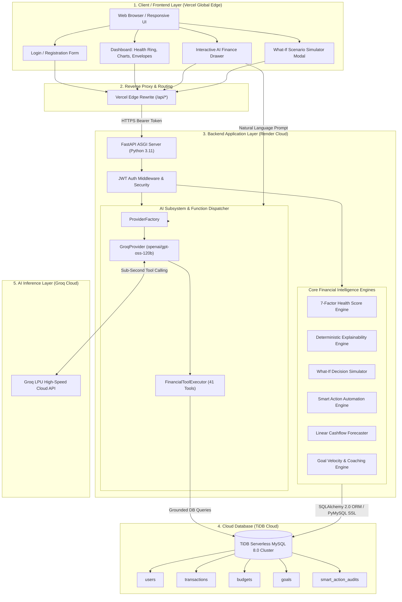
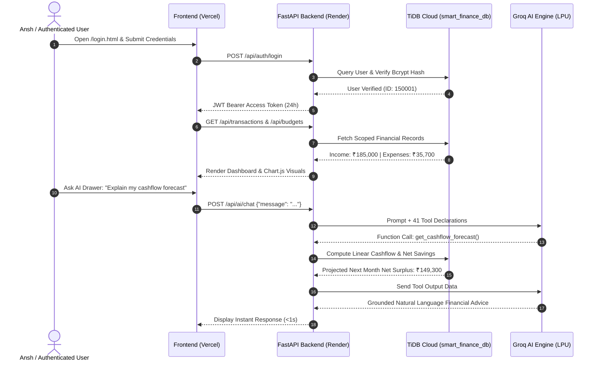
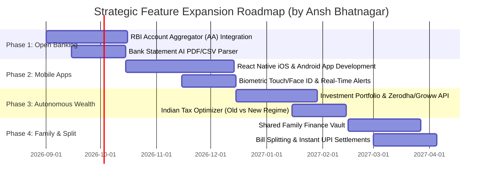

# 🚀 Smart Personal Finance Dashboard
### **Enterprise-Grade Full-Stack Financial Intelligence & Autonomous AI Platform**
**Author & Lead Architect:** **Ansh Bhatnagar**

[](https://smart-personal-finance-dashboard-zed3.onrender.com/docs)
[](https://smart-personal-finance-dashboard-on7q-enbzq76ur.vercel.app)
[](https://tidbcloud.com)
[](https://groq.com)
[](https://fastapi.tiangolo.com)
[](https://www.python.org/)
[](https://www.sqlalchemy.org/)
[](https://www.chartjs.org/)
[-brightgreen.svg)](#-test-suite--verification)
[](LICENSE)

An intelligent, full-stack personal finance and wealth management platform designed and engineered by **Ansh Bhatnagar**. Built with a **Vanilla HTML5/CSS3/JavaScript (ES6+)** design system and an asynchronous **Python FastAPI + SQLAlchemy 2.x** backend deployed on **Render** and backed by a **TiDB Cloud Serverless** distributed MySQL database. Powered by **Groq Cloud LPU Inference Engine** (`openai/gpt-oss-120b`) delivering sub-second financial advice across **41 specialized financial function-calling tools**.

---

## 🌐 Live Production Deployment & Application Links

| Service / Page | Platform | Live URL / Endpoint | Status |
| :--- | :--- | :--- | :--- |
| 🔑 **Direct Login Page** | [Vercel](https://vercel.com) | [smart-personal-finance.../login.html](https://smart-personal-finance-dashboard-on7q-enbzq76ur.vercel.app/login.html) | 🟢 **Live** |
| 📝 **Direct Register Page** | [Vercel](https://vercel.com) | [smart-personal-finance.../register.html](https://smart-personal-finance-dashboard-on7q-enbzq76ur.vercel.app/register.html) | 🟢 **Live** |
| 📊 **Main Dashboard UI** | [Vercel](https://vercel.com) | [smart-personal-finance-dashboard...vercel.app](https://smart-personal-finance-dashboard-on7q-enbzq76ur.vercel.app) | 🟢 **Live** |
| ⚡ **Backend API** | [Render](https://render.com) | [smart-personal-finance-dashboard-zed3.onrender.com](https://smart-personal-finance-dashboard-zed3.onrender.com) | 🟢 **Live (200 OK)** |
| 📖 **Interactive Swagger Docs** | [OpenAPI 3.1](https://fastapi.tiangolo.com) | [smart-personal-finance-dashboard-zed3.onrender.com/docs](https://smart-personal-finance-dashboard-zed3.onrender.com/docs) | 🟢 **Online** |
| 🩺 **Backend Health Probe** | [FastAPI Health](https://smart-personal-finance-dashboard-zed3.onrender.com/health/ready) | `GET /health/ready` | 🟢 **Healthy (DB & AI Ready)** |
| 🗄️ **Production Database** | [TiDB Cloud](https://tidbcloud.com) | Serverless Distributed MySQL Cluster (`smart_finance_db`) via PyMySQL + SSL | 🟢 **Connected** |
| 🤖 **AI Engine** | [Groq Cloud](https://groq.com) | Groq LPU (`openai/gpt-oss-120b`) + 41 Financial Tools | 🟢 **Ultra Fast** |

---

## 📊 End-to-End System Architecture Flowchart



---

## 🔄 User Financial Lifecycle Flowchart



---

## 🌟 Key Architecture & Capabilities

### 1. 7-Dimension Financial Health Score Engine
Evaluates algorithmic financial resilience on a deterministic **0–100 score** across 7 weighted dimensions:
- **Cashflow Health (20%)**: Operating monthly surplus margin.
- **Savings Health (15%)**: Savings rate compared to benchmark 20%+ target.
- **Budget Health (15%)**: Envelope adherence and overrun penalties.
- **Goal Health (15%)**: Aggregate goal completion velocity and timeline gap.
- **Emergency Buffer (15%)**: Months of expenditure coverage against 3–6 month target.
- **Debt Health (10%)**: Debt-to-income ratio (DTI).
- **Expense Stability (10%)**: Month-over-month spending volatility.
- **Status Classification**: `EXCELLENT` (85–100), `GOOD` (70–84), `FAIR` (50–69), `POOR` (30–49), `CRITICAL` (<30).

### 2. AI Explainability Engine
Eliminates opaque AI "black box" responses by synthesizing **6 structured explanation models** with verified database evidence citations, mathematical calculation basis, and explicit limitations:
- `WHY_THIS_HEALTH_SCORE`
- `WHY_THIS_FORECAST`
- `WHY_THIS_RISK`
- `WHY_THIS_GOAL_STATUS`
- `WHY_THIS_SMART_ACTION`
- `WHY_THIS_SUGGESTION`

### 3. What-If Financial Decision Simulator
Enables interactive hypothetical projections across **8 financial scenarios** with **zero database mutations**:
- `INCREASE_SAVINGS`: Project compound growth and runway expansion.
- `REDUCE_EXPENSES`: Trim discretionary budget allocations.
- `INCREASE_EXPENSES`: Test lifestyle inflation impacts.
- `INCOME_REDUCTION` / `INCOME_INCREASE`: Stress-test cashflow against career or salary changes.
- `GOAL_DEADLINE_CHANGE`: Adjust target completion timelines.
- `MONTHLY_CONTRIBUTION_CHANGE`: Recalculate goal velocity.
- `DEBT_PAYMENT_CHANGE`: Accelerate debt paydown.

### 4. AI Financial Automation & Smart Actions
Transforms passive recommendations into **safe, user-confirmed actions** using a strict state machine:
- Lifecycle: `PROPOSED` $\rightarrow$ `CONFIRMED` $\rightarrow$ `EXECUTED` (or `REJECTED` / `EXPIRED`).
- **Zero Autonomous Writes**: AI cannot directly modify the database without explicit user confirmation.
- **SHA-256 Tamper Detection**: Proposal payloads are cryptographically hashed to prevent modification.
- **Immutable Audit Trail**: All confirmations, executions, and rejections are permanently logged to the `smart_action_audits` table.

### 5. Forecasting & Predictive Risk Detection
- **Deterministic Linear Regression**: Evaluates multi-month expenditure trends and predicts next month cashflow.
- **Early Overrun Warnings**: Flags category envelope overrun probabilities before they occur.
- **Multi-Risk Classifications**: Evaluates cashflow depletion risks, low savings velocity, and discretionary spikes.

### 6. Financial Goals & Personalized AI Coaching
- **Goal Management**: Scoped creation, update, progress tracking, and priority tagging (`low`, `medium`, `high`, `critical`).
- **Required Pace Calculation**: Automatically calculates monthly savings required to hit target dates.
- **AI Coaching Prompts**: Generates tailored step-by-step advice grounded in active financial records.

### 7. 41-Tool AI Financial Assistant (Powered by Groq)
- **Ultra-Low Latency Inference**: High-throughput responses powered by Groq's Language Processing Units (LPU).
- **Model**: `openai/gpt-oss-120b` with multi-turn tool calling.
- **Strict XML Context Pipeline**: Injects verified data using `<FINANCIAL_HEALTH_SCORE>`, `<FINANCIAL_EXPLANATIONS>`, `<SIMULATION_CONTEXT>`, `<FINANCIAL_INTELLIGENCE>`, `<FINANCIAL_CONTEXT>`, `<GOALS_PROGRESS>`, and `<SMART_ACTIONS>`.
- **Anti-Prompt Injection Guardrails**: 36 mandatory operational rules prevent prompt leaking, data hallucination, or unauthorized cross-tenant data access.

---

## 🔮 Strategic Future Roadmap & Advanced Features
### *Architected & Planned by Ansh Bhatnagar*



### 📍 1. Automated Bank Account Ingestion & Open Banking (Q3 2026)
* **RBI Account Aggregator (AA) Integration**: Seamless connection with Indian banks (HDFC, ICICI, SBI, Axis) via RBI-regulated AA ecosystem for auto-fetching transactions via UPI & Netbanking without sharing credentials.
* **Smart Statement Parser**: Drag-and-drop PDF & CSV bank statement processor with automatic regex parsing and ML merchant categorization.
* **SMS Transaction Ingestion**: Automatic parsing of banking SMS alerts for instant real-time expense tracking.

### 📍 2. Native Cross-Platform Mobile Applications (Q4 2026)
* **React Native / Flutter Apps**: Dedicated native apps on the Google Play Store and Apple App Store.
* **Biometric Authentication**: One-touch sign-in via Fingerprint and Face ID.
* **Smart Push Notifications**: Timely warning notifications when approaching 80% of any category budget envelope.

### 📍 3. Autonomous Wealth Advisor, Investments & Tax Optimization (Q1 2027)
* **Live Portfolio Aggregation**: Integration with stock brokers (Zerodha Kite, Groww API) to track Mutual Funds, Equity Stocks, and Digital Gold.
* **Indian Tax Optimizer**: Automated comparison between Old and New Income Tax Regimes with personalized recommendations for Section 80C, 80D, NPS, and HRA exemptions.
* **Micro-Savings Round-Ups**: Automatic round-up of transactions to the nearest ₹10 or ₹100, funneling spare change into an automated high-yield emergency buffer.

### 📍 4. Collaborative Family Finance & Group Expense Splitting (Q2 2027)
* **Family Household Vault**: Multi-user shared budgets for households and couples with customizable viewing and spending permissions.
* **Integrated Bill Splitting (Splitwise Alternative)**: Split dinner, trip, or utility bills with friends, featuring instant settlement links with direct UPI QR codes.

### 📍 5. Multi-Currency Global Engine & Voice AI (Q3 2027)
* **Forex Multi-Currency Support**: Real-time conversion and multi-currency tracking (INR, USD, EUR, GBP, AED, CAD, JPY).
* **Voice-Activated Financial AI**: Conversational voice commands in Hindi and English powered by high-speed Groq Whisper audio models.

---

## 📁 Directory Structure

```text
smart-personal-finance/
├── frontend/                     # Vanilla HTML5 + CSS3 + ES6 JavaScript
│   ├── index.html                # Main financial intelligence dashboard
│   ├── login.html                # User authentication portal
│   ├── register.html             # Account registration page
│   ├── vercel.json               # Vercel proxy rewrite config
│   ├── css/
│   │   ├── style.css             # Glassmorphic tokens, theme variables, reset
│   │   ├── dashboard.css         # Health ring, stat cards, simulation & action UI
│   │   └── responsive.css        # Mobile, tablet & desktop media breakpoints
│   └── js/
│       ├── api.js                # Centralized FastAPI client & JWT token handling
│       ├── app.js                # AppState store & lifecycle controller
│       ├── auth.js               # Sign in, registration, strength validation
│       ├── dashboard.js          # Health score, simulations, explanations, AI drawer
│       ├── transactions.js       # Transaction CRUD, multi-filter, search, pagination
│       ├── budgets.js            # Category envelopes & live utilization tracking
│       └── charts.js             # Theme-aware Chart.js visualizers
├── backend/                      # Python 3 + FastAPI + SQLAlchemy 2.x
│   ├── app/
│   │   ├── main.py               # FastAPI entrypoint, middleware, router mount
│   │   ├── core/
│   │   │   ├── config.py         # Pydantic Settings v2 (.env management)
│   │   │   ├── database.py       # SQLAlchemy engine & session factory
│   │   │   └── security.py       # bcrypt hashing & JWT token verification
│   │   ├── models/               # SQLAlchemy 2.x mapped models
│   │   │   ├── user.py, transaction.py, budget.py, goal.py, smart_action.py
│   │   ├── schemas/              # Pydantic v2 validation models
│   │   ├── routers/              # Protected API endpoints (/auth, /transactions, /budgets, /goals, /ai/*)
│   │   └── services/
│   │       ├── auth_service.py, transaction_service.py, budget_service.py, finance_service.py
│   │       └── ai/               # AI Subsystems & Coordinators
│   │           ├── ai_service.py, prompt_builder.py, system_instructions.py
│   │           ├── groq_provider.py    # Groq LPU Integration
│   │           ├── gemini_provider.py  # Google Gemini Integration
│   │           ├── mock_provider.py    # Offline Testing Provider
│   │           ├── provider_factory.py # Dynamic Provider Resolver
│   │           ├── intelligence/       # HealthScoreEngine & UnifiedIntelligenceEngine
│   │           ├── explainability/     # ExplanationEngine
│   │           ├── simulation/         # SimulationEngine
│   │           ├── automation/         # SmartActionEngine & ActionExecutor
│   │           ├── forecasting/        # ForecastingEngine
│   │           ├── risk/               # RiskEngine
│   │           ├── goals/              # GoalService & GoalCalculator
│   │           ├── planning/           # PlanningEngine & ScenarioEngine
│   │           ├── insights/           # InsightEngine
│   │           └── tools/              # 41 Tool Definitions & Execution Handlers
│   ├── .env.example
│   ├── requirements.txt
│   └── README.md
├── render.yaml                   # Infrastructure-as-Code for Render Cloud deployment
├── vercel.json                   # Root Vercel configuration with /api proxy
└── scratch/                      # Multi-phase automated test suites & verification scripts
```

---

## 📡 API Endpoints Reference

### 🔐 Authentication & Profile (`/api/auth`)
| Method | Endpoint | Description |
| :--- | :--- | :--- |
| `POST` | `/api/auth/register` | Register a new user account |
| `POST` | `/api/auth/login` | Authenticate and obtain JWT access token |
| `GET` | `/api/auth/me` | Retrieve authenticated user profile |

### 💳 Transactions & Budgets (`/api/transactions`, `/api/budgets`)
| Method | Endpoint | Description |
| :--- | :--- | :--- |
| `GET` | `/api/transactions` | List user transactions (filterable by type, category, date) |
| `POST` | `/api/transactions` | Create a new income/expense transaction |
| `PUT` | `/api/transactions/{id}` | Update transaction details |
| `DELETE` | `/api/transactions/{id}` | Remove a transaction |
| `GET` | `/api/budgets` | Retrieve active monthly budget envelopes |
| `POST` | `/api/budgets` | Set or adjust category budget envelope |
| `DELETE` | `/api/budgets/{id}` | Remove budget envelope |

### 🎯 Financial Goals (`/api/goals`)
| Method | Endpoint | Description |
| :--- | :--- | :--- |
| `GET` | `/api/goals` | List financial goals with calculated progress & pace |
| `POST` | `/api/goals` | Create a financial goal |
| `PUT` | `/api/goals/{id}` | Update goal amount or target date |
| `DELETE` | `/api/goals/{id}` | Delete a goal |

### 🤖 AI Financial Intelligence & Explanations (`/api/ai/*`)
| Method | Endpoint | Description |
| :--- | :--- | :--- |
| `GET` | `/api/ai/intelligence` | Unified master intelligence aggregate payload |
| `GET` | `/api/ai/health-score` | 7-factor financial health score (0–100) & dimensions |
| `GET` | `/api/ai/explanations` | List active domain explanations |
| `GET` | `/api/ai/explanations/{type}` | Detailed explanation drill-down |
| `POST` | `/api/ai/simulate` | Execute what-if financial decision simulation |
| `GET` | `/api/ai/simulation/examples` | Retrieve preset simulation templates |
| `GET` | `/api/ai/actions` | Retrieve active Smart Action proposals |
| `POST` | `/api/ai/actions/{id}/confirm` | User confirmation for proposed action |
| `POST` | `/api/ai/actions/{id}/execute` | Execute confirmed action server-side |
| `POST` | `/api/ai/actions/{id}/reject` | Reject action proposal |
| `GET` | `/api/ai/actions/history` | Immutable audit history of actions |
| `POST` | `/api/ai/chat` | Context-grounded conversational AI assistant (Groq) |
| `GET` | `/api/ai/status` | AI provider connectivity and model status |

---

## 🔒 Security & Anti-Hallucination Design

1. **Strict Tenant Isolation**: All database queries enforce strict filtering by authenticated user ID (`WHERE user_id == token.user_id`).
2. **Zero Secrets in AI Prompts**: Passwords, hashes, JWT keys, and API tokens are barred from prompts and model contexts.
3. **Database Grounding**: AI has no unmonitored database access. All data is fetched through certified Python service classes.
4. **Prompt Injection Defense**: User inputs are sanitized and isolated inside structured XML blocks to prevent prompt escapes.
5. **Two-Stage Action Confirmation**: AI recommendations cannot mutate balances or envelopes without explicit user confirmation.

---

## 🧪 Test Suite & Verification

The project includes an automated regression test suite covering all architecture phases:

```bash
# Run the complete regression test suite:
python scratch/run_all_regression_tests.py

# Verify live production journey:
python scratch/test_live_user_journey.py

# Verify Groq AI provider integration:
python scratch/test_groq_integration.py
```

### Verified Multi-Phase Test Results: **355/355 Passed (100%)**
- ✅ Phase 2.2: Authentication & JWT Security (**8/8**)
- ✅ Phase 2.3: Transaction Management & Analytics (**6/6**)
- ✅ Phase 2.4: Budget Envelopes & Overrun Prediction (**4/4**)
- ✅ Phase 2.5: Financial Analytics & Health Score (**3/3**)
- ✅ Phase 3.1: Production Security & Validation (**4/4**)
- ✅ Phase 3.2: Financial Intelligence Services (**6/6**)
- ✅ Phase 3.3: AI Assistant Architecture & Tool Calling (**4/4**)
- ✅ Phase 3.4: AI Financial Intelligence & Reasoning (**23/23**)
- ✅ Phase 3.5: Proactive AI Insights & Recommendations (**30/30**)
- ✅ Phase 3.6: AI Goals, Planning & Personalized Coaching (**47/47**)
- ✅ Phase 3.7: AI Financial Forecasting & Risk Detection (**48/48**)
- ✅ Phase 3.8: AI Financial Automation & Smart Actions (**77/77**)
- ✅ Phase 3.9: AI Intelligence Finalization, Explainability & Simulation (**95/95**)

---

## 👤 Author & Creator

**Ansh Bhatnagar**  
*Lead Full-Stack & AI Software Engineer*  
- **GitHub**: [@anshbhatnagara-gif](https://github.com/anshbhatnagara-gif)  
- **Project Repository**: [Smart-Personal-Finance-Dashboard-](https://github.com/anshbhatnagara-gif/Smart-Personal-Finance-Dashboard-)

---

## 📄 License
This project is open-source and licensed under the [MIT License](LICENSE).
