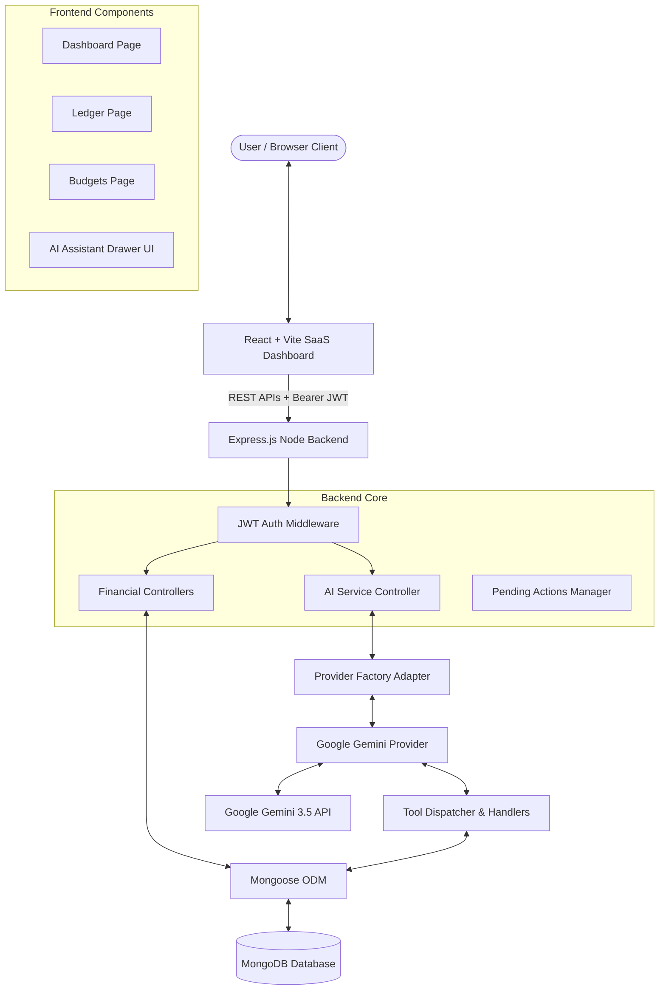
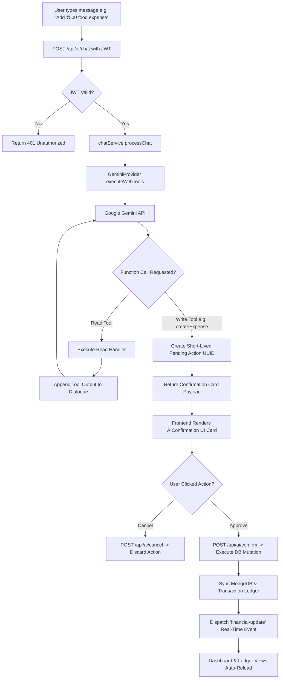

# Smart Personal Finance Dashboard MVP 💰

A full-stack, AI-powered personal finance management dashboard built with **React**, **Node.js/Express**, **MongoDB**, and **Google Gemini AI**.

The dashboard provides real-time financial tracking, monthly budget planning, expense analytics, category breakdowns, savings insights, and an interactive **AI Assistant** capable of natural language queries (English & Hinglish) and multi-turn financial reasoning.

---

## 🌟 Key Features

- 📊 **Dashboard & Financial Summary**: Total income, total expenses, net savings, budget progress, category breakdown charts, and recent transaction logs.
- 💳 **Income & Expense Management**: Full CRUD operations with automatic unified ledger syncing.
- 🎯 **Monthly Budgeting**: Set monthly spending caps and receive visual utilization progress indicators.
- 🤖 **Powerful AI Assistant**:
  - **Natural Language & Hinglish Support**: Understands queries like *"bhai iss month sabse zyada kharcha kaha hua?"*, *"How much did I spend on food?"*, *"Add ₹500 food expense today"*.
  - **Multi-Turn Tool Reasoning**: Executes multiple backend analytical queries in sequence before formulating an answer.
  - **Personalized Insights**: AI-generated financial health summaries and recommendations.
  - **Safe Write Actions & Confirmation Cards**: AI proposes financial mutations (create/update/delete income, expense, or budget), but requires explicit user confirmation via an interactive UI card before executing any database changes.

---

## 📊 System Architecture & Flowcharts

### 1. Overall System Architecture Flowchart



---

### 2. AI Assistant Tool Calling & Safe Confirmation Flowchart



---

### 3. Multi-Turn Financial Intelligence Reasoning Loop

```mermaid
flowchart LR
    Start([User Question: 'Why did my spending increase?']) --> Turn1[Turn 1: Gemini calls analyzeSpending for current month]
    Turn1 --> Handlers1[Fetch current month spending aggregate]
    Handlers1 --> Turn2[Turn 2: Gemini calls analyzeSpending for previous month]
    Turn2 --> Handlers2[Fetch previous month spending aggregate]
    Handlers2 --> Turn3[Turn 3: Gemini calls analyzeCategories for category breakdown]
    Turn3 --> Handlers3[Fetch category shifts & MoM deltas]
    Handlers3 --> FinalTurn[Turn 4: Gemini synthesizes comparison data into concise, structured answer]
    FinalTurn --> Output([Display formatted response with ₹ breakdown])
```



---

## 🛠️ Tech Stack

- **Frontend**: React 18, Vite, Lucide Icons, CSS Custom Properties (Dark/SaaS Aesthetics)
- **Backend**: Node.js, Express.js, JWT (JsonWebToken), BcryptJS, Express Rate Limit
- **Database**: MongoDB & Mongoose ODM
- **AI Integration**: Google Gen AI SDK (`@google/genai`), Google Gemini 3.5 API, Function Calling / Tool Execution Protocol

---

## ⚙️ Installation & Setup Instructions

### Prerequisites
- Node.js (v18+ recommended)
- MongoDB running locally on `mongodb://127.0.0.1:27017` or MongoDB Atlas URI
- Google Gemini API Key

---

### 1. Backend Setup

```bash
cd backend
npm install
```

Create a `.env` file in `backend/.env`:

```env
PORT=5000
MONGO_URI=mongodb://127.0.0.1:27017/finance-db
JWT_SECRET=supersecretjwtkey12345
NODE_ENV=development

# AI Configuration
AI_PROVIDER=gemini
AI_MODEL=gemini-3.5-flash
AI_API_KEY=YOUR_GOOGLE_GEMINI_API_KEY
```

Start the backend server:

```bash
npm run dev
```

---

### 2. Frontend Setup

```bash
cd frontend
npm install
```

Start the frontend development server:

```bash
npm run dev
```

Open `http://localhost:3000` (or `http://localhost:3001`) in your browser.

---

## 🧪 Verification & Testing

To run the complete automated end-to-end backend and AI test suite:

```bash
cd backend
node scripts/verify_apis.js
```

To build the production frontend bundle:

```bash
cd frontend
npm run build
```

---

## 🔒 Security Highlights

- **JWT Session Security**: All AI endpoints require Bearer Token authorization.
- **Strict Data Isolation**: Multi-tenant boundaries prevent users from reading or mutating other users' data.
- **Replay Protection**: Pending action UUIDs are single-use and short-lived (5-minute expiration).
- **Sanitized Arguments**: MongoDB query operator injections (`$where`, `$regex`, etc.) are stripped.

---

## 📜 License

MIT License. Designed and developed as part of the Smart Personal Finance Dashboard MVP.
